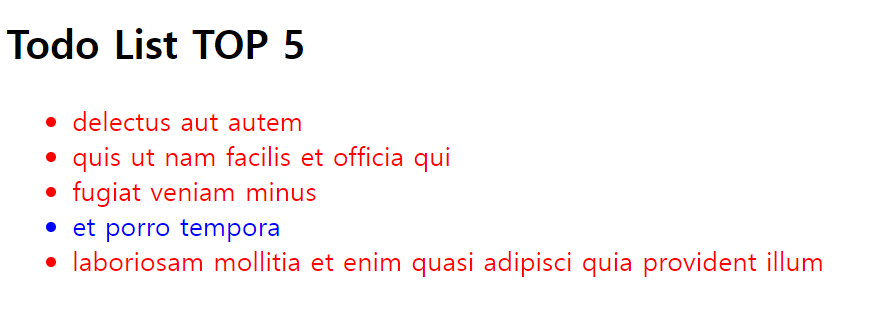

# Single Response Principle

단일 책임 원칙인 `SRP` 는 종종 _하나의 함수는 하나의 일만 해야 한다_ 라는 의미로 잘못 전달되는 경우가 있는데

하나의 함수가 하나의 일만 해야 한다는 원칙은 다른 원칙 명이 있으며 `SRP` 는 이에 해당하지 않는다.

프로그램을 구성하는 모듈과 컴포넌트 들은 결국

**이해관계자 , 사용자** 의 니즈를 충족시키기 위한 목적을 가지고 만들어져있다.

이 때 이해 관계자, 사용자들을 `actor` 라는 단어로 묶어 설명하자면

**모듈,컴포넌트의 수정은 하나의 액터에 대해서만 책임져야한다.** 로 정의 할 수 있다.

책임을 진다는 것은 컴포넌트의 수정 단위가 하나의 액터에게만 영향을 끼쳐야 한다는 것을 의미한다.

여러 액터들이 하나의 컴포넌트에 **응집되어 있다면 (`cohensive`)** `SRP` 원칙을 지키고 있지 못함을 의미한다.

### `SRP` 를 지키지 못한 경우

> 교재에서는 `class` 를 이용하여 설명하는데 나는 리액트를 공부하고 있으니 리액트를 기준으로 예시를 만들어 생각해보려 한다.

```jsx
import { useEffect, useState } from 'react';

export default function App() {
  const [todo, setTodo] = useState([]);

  useEffect(() => {
    const getTodos = async () => {
      const endPoint = 'https://jsonplaceholder.typicode.com/todos';
      const res = await fetch(endPoint, { method: 'GET' });
      const body = await res.json();

      setTodo(body);
    };
    getTodos();
  }, []);

  const filterTodo = (todo) => todo.slice(0, 5);

  return (
    <article>
      <h1>Todo List TOP 5</h1>
      <ul>
        {filterTodo(todo).map(({ title, completed }) => (
          <li style={{ color: completed ? 'blue' : 'red' }}>{title}</li>
        ))}
      </ul>
    </article>
  );
}
```



현재 `App` 컴포넌트의 목적은 **모든 `todos` 를 패칭해온 후 그 중 상위 5개의 `todo`들을 렌더링 하는 것이다.**

다만 현재의 `App` 컴포넌트는 여러가지 `actor` 가 조합된 형태로 존재한다.

1. `todo` 데이터를 패칭해오는 `fetching actor`
2. 패칭해온 `todo` 데이터를 상위 5가지로 필터링 하는 `filter actor`
3. 필터링된 `todo` 데이터를 렌더링 하는 `render(return) actor`

### `SRP` 를 지키지 못했을 때의 단점

#### 수정과 확장에 개방적이지 못하다.

`App` 컴포넌트에서 `fetching actor` 를 수정하게 되면 수정한 결과의 책임은 `getTodos actor` 에게만 있느 것이 아닌

2, 3 번째 `actor` 인 `filter actor , render actor` 에게도 영향을 미친다.

만약 `fetching actor` 을 사용하는 다른 곳에서 `나는 완료되지 않은 todos 만 패칭해오면 좋겠어` 라는 의견을 내어

`fetching actor` 를 변경한다고 해보자

> 하지만 애석하게도 여전히 `App` 컴포넌트는 `fetching actor` 의 변경에 영향을 받지만 이 사실을 모르고 개발하고 있다고 가정하자

```jsx
import { useEffect, useState } from 'react';

export default function App() {
  const [todo, setTodo] = useState([]);

  useEffect(() => {
    const getTodos = async () => {
      const endPoint = 'https://jsonplaceholder.typicode.com/todos';
      const res = await fetch(endPoint, { method: 'GET' });
      const body = await res.json();
      setTodo(body.filter(({ completed }) => !completed));
    };
    getTodos();
  }, []);

  const filterTodo = (todo) => todo.slice(0, 5);

  return (
    <article>
      <h1>Todo List TOP 5</h1>
      <ul>
        {filterTodo(todo).map(({ title, completed }) => (
          <li style={{ color: completed ? 'blue' : 'red' }}>{title}</li>
        ))}
      </ul>
    </article>
  );
}
```


`fetching actor` 의 변경 사항이 `filter actor , render actor` 에게도 모두 영향을 미쳐 `App` 컴포넌트의 목적과 맞지 않은 결과를 초래했다.

**이처럼 각자의 코드가 서로에게 영향을 미치는 , 즉 의존적인 관계의 컴포넌트는 개별적인 수정 혹은 기능 추가에 있어서 매우 폐쇄적이다. 하나를 수정하면 얽혀있는 모든 것을 수정해야 한다는 것이다.**

#### 컴포넌트의 가독성이 떨어지고 관리가 어려워진다.

위처럼 `App` 컴포넌트에 여러 `actor` 가 얽히고 섥혀있기 때문에

`App` 컴포넌트의 목적이 무엇인지 알기가 쉽지 않다.

데이터를 패칭해오는 것인지, 데이터를 필터링 하는 것인지, 렌더링 하는 것인지 말이다.

### `SRP` 를 지켜 리팩토링 해보자

#### 수평과 확장에 용이 할 수 있도록 의존성을 제거해보자 (`DIP`)

> 사실 이 부분은 `SRP` 에 대한 내용보다 `DIP (Dependency Inversion Principle)` 인 의존성 역전에 가깝다. 모듈간의 순차적 흐름에 의한 의존성에서 다른 의존성 체계를 구성함으로서
>
> 모듈 기능의 흐름 방향이 의존성을 따르지 않도록 하기 위해 특정 의존성 체계를 설립하고 각 모듈의 기능 흐름 방향을 단방향적으로 만들지 않는 과정을 살펴보자

`SRP` 가 지켜지지 않는 다는 것을 알 수 있는 가장 직관적인 지표는

모듈 하나를 수정하면 그와 관련된 여러 모듈을 모두 수정해야 한다는 것이다.

위 예시에서는 각 모듈 간의 의존성이 얽히고 섥혀 모듈 하나가 수정되면 모듈의 조합으로 이뤄진

컴포넌트가 본연의 기능을 잃기에 본 기능을 유지하기 위한 새로운 모듈을 새로 만들어야 한다.

위 예시의 3가지 `actor` 중 하나만 변경하더라도 모든 `actor` 를 수정하거나 추가해야 하는 모습을 볼 수 있다.

이는 여러 모듈이 서로 **높은 응집성을 보이며 의존하고 있기 때문이다.**

확장에 용이 할 수 있도록 우선적으로 `actor` 들이 서로에게 영향을 미치지 않도록 하기 위해

의존 관계를 체계화 하여야 한다.

현재의 `App` 컴포넌트의 결과는 `fetching actor -> filter actor -> render actor` 의 결과값에 따라 변경되며 `App` 컴포넌트의 기능 흐름의 방향과 같이 의존성을 가지고 있음을 알 수 있다.

이론 의존성 관계를 **다른 의존성을 갖도록 의존성 체계를 변경해야 한다.**

단방향적 의존성 관계의 방향은 해당 기능 변화의 책임이 의존성 방향을 따라 아래로 흐르게 된다.

#### `render actor` 의 의존성 정의

```jsx
export default function App({num = 5}) {
  ...
  return (
    <article>
      <h1>Todo List TOP {num}</h1>
      <ul>
        {filterdTodo(todo, {num}).map(({ title, completed }) => (
          <li style={{ color: completed ? 'blue' : 'red' }}>{title}</li>
        ))}
      </ul>
    </article>
  );
}
```

`App` 컴포넌트의 `actor` 를 `render actor` 하나로 변경함으로서 항상 `App` 컴포넌트의 수정은 오로지 `render actor` 에만 영향을 미치게 변경한다.

또한 `render actor` 의 변경(렌더링 할 `todo` 의 개수)이 오로지 렌더링 결과에만 책임을 질 수 있도록 변경 가능한 내용을 `props`로 정의해주고 `parameter` 로 전달한다.

#### `filter actor` 의 의존성 정의

```js
  const filterTodo = (todo) => todo.slice(0, 5); 에서
  const filterdTodo = (todo, num , start = 0) => todo.slice(start, num); 로 변경
```

`filter actor` 는 항상 인수로 받은 `todo` 를 필터링한 결과값만을 반환하도록 정의하고

확장에 용이 할 수 있도록 세부 사항에 따라 결과 값이 바뀌도록

객체 지향의 다형성 원칙을 적용시켜 정의한다.

#### `fetching actor` 의존성 정의

`fetching actor` 는 항상 모든 데이터를 패칭해오도록 정의해줘야 한다.

만약 위처럼 `fetching actor` 를 변경해주고 싶다면 변경된 새로운 독립적인 `fetcing actor` 를 만들도록 하거나 `fetching actor` 가 세부사항에 따라 다른 행위를 할 수 있도록

확장해줘야 한다.

```js
export default function App({ num = 5, isUncomplete = false }) {
  const [todo, setTodo] = useState([]);

  useEffect(() => {
    const getTodos = async () => {
      const endPoint = 'https://jsonplaceholder.typicode.com/todos';
      const res = await fetch(endPoint, { method: 'GET' });
      const body = await res.json();

      const result = body.filter(({ completed }) =>
        isUncomplete ? !completed : true,
      );

      setTodo(result);
    };

    getTodos();
  }, [isUncomplete]);
  ...
```

이처럼 변경해주면 `fetching actor` 는 `isUncomplete` 라는 세부 사항에 따라 다르게 작동하게 된다.

현재의 방법은 `actor` 들의 수정이 서로에게 영향을 미치지 않고 서로에게 영향을 미치는 유일한 존재를

컴포넌트 내의 세부 사항인 `props` 에 따라서 변경되도록 의존성을 변경시킨 것이다.

#### `SRP` 를 지켜 컴포넌트의 목적을 명확히 하자

```jsx
import { useEffect, useState } from 'react';

export default function App({ num = 5, isUncomplete = false }) {
  const [todo, setTodo] = useState([]);

  useEffect(() => {
    const getTodos = async () => {
      const endPoint = 'https://jsonplaceholder.typicode.com/todos';
      const res = await fetch(endPoint, { method: 'GET' });
      const body = await res.json();

      const result = body.filter(({ completed }) =>
        isUncomplete ? !completed : true,
      );

      setTodo(result);
    };

    getTodos();
  }, [isUncomplete]);

  const filterdTodo = (todo, num, start = 0) => todo.slice(start, num);

  return (
    <article>
      <h1>Todo List TOP {num}</h1>
      <ul>
        {filterdTodo(todo, num).map(({ title, completed, id }) => (
          <li key={id} style={{ color: completed ? 'blue' : 'red' }}>
            {title}
          </li>
        ))}
      </ul>
    </article>
  );
}
```

이렇게 `actor` 별 의존성을 제거해주었지만 여전히 코드를 한 눈에 알아보기 힘들다는 것은 동일하다 .

`App` 컴포넌트의 주 목적인 `render actor` 만 존재하도록 위 `fetching , filter actor` 들을 따로 커스텀훅으로 빼주자

```jsx
export default const useFilteredTodo = (num, isUncomplete) => {
  const [filtedTodo, setFiltedTodo] = useState([]);

  useEffect(() => {
    const getTodos = async () => {
      const endPoint = 'https://jsonplaceholder.typicode.com/todos';
      const res = await fetch(endPoint, { method: 'GET' });
      const body = await res.json();

      const result = body.filter(({ completed }) =>
        isUncomplete ? !completed : true,
      );

      const filterdTodo = (todo, num, start = 0) => todo.slice(start, num);

      setFiltedTodo(filterdTodo(result, num));
    };

    getTodos();
  }, []);

  return [filtedTodo, setFiltedTodo];
};
```

```jsx
import { useEffect, useState } from 'react';
import useFilteredTodo from './hook/useFilteredTodo';

export default function App({ num = 5, isUncomplete = false }) {
  const [filterdTodo, _] = useFilteredTodo(num, isUncomplete);

  return (
    <article>
      <h1>Todo List TOP {num}</h1>
      <ul>
        {filterdTodo.map(({ title, completed, id }) => (
          <li key={id} style={{ color: completed ? 'blue' : 'red' }}>
            {title}
          </li>
        ))}
      </ul>
    </article>
  );
}
```

> `class` 기반에서 `SRP` 를 지키면서 확장 하기 위해 `Facade pattern` 을 이용하는데
> 리액트 컴포넌트에선 `HOC (Higher order component)`를 이용하여 해당 패턴과 비슷하게 하여 컴포넌트를 확장한다.
> 이와 관련된 내용은 `SOLID` 원칙을 마저 다 읽고 공부해봐야겠다.

> # 정리
>
> `SOLID` 원칙 중 하나인 `SRP (Single Response Principle)` 은 중간 수준의 아키텍쳐 (거대한 프로그램을 구성하기 위해 여러 모듈과 컴포넌트의 조합으로 이뤄진 아키텍쳐) 를 수정 할 때
> 하나의 수정 사항이 오직 하나의 액터에 대해서만 책임 져야 한다는 것을 의미한다.
> _하나의 일만 해야 한다는 것과 혼동하지 말자 , 컴포넌트는 여러 가지 일을 할 수 있다._
>
> 하나의 액터에 대해서만 책임을 진다는 것은, 한 액터의 수정이 다른 액터들에게 영향을 끼치면 안된다는 것을 의미한다.
>
> 만약 어떤 액터의 수정이 다른 액터에게도 영향을 미친다면 두 액터가 의존성을 갖고 있는지를 확인하고 , 만약 기능을 확장 할 것이라면 의존성을 다른 요소로 역전시키거나 다른 독립적인 액터를 추가해주도록 하자
