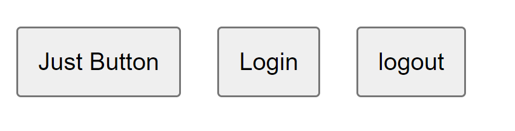
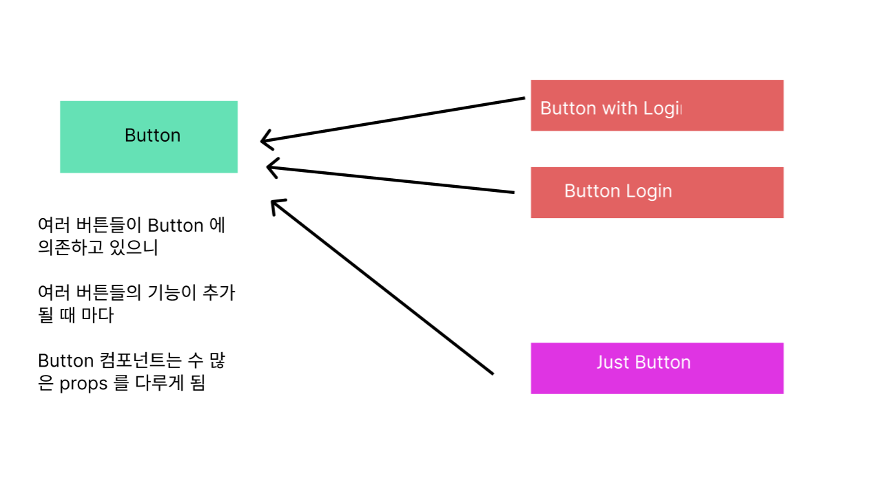
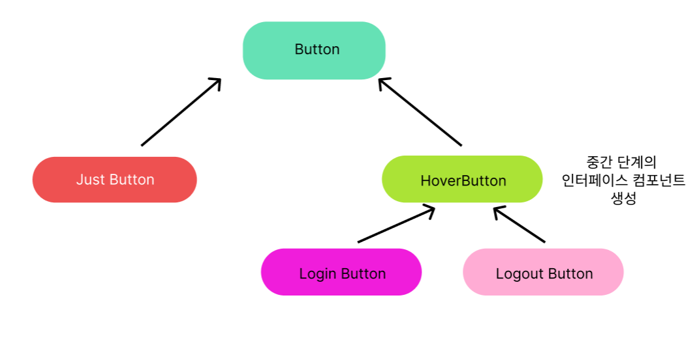

# `Open Closed Principle`

### 정의

`OCP` 는 소프트웨어 개체는 확장에는 열려있어야 하고 변경에는 닫혀있어야 한다는 것을 의미한다.

즉, 소프트웨어 개체의 행위는 확장 가능하지만 개체 자체를 변경하는 행위를 지양해야 한다는 것이다.

그 이유는 소프트웨어 아키텍쳐는 여러 모듈과 컴포넌트의 조합으로 이뤄져있으며

각 모듈과 컴포넌트는 서로 의존성 방향을 가지며 구성되어 있다.

대표적인 예시를 통해 이해해보자

> 본 교재에서는 사고실험을 통해 예시를 드는데 나는 리액트를 기준으로 하여 실험을 통해 알아보도록 하자

### `OCP` 을 지키지 않았을 때의 사고 실험

```jsx
function Button({ label, onClick }) {
  return <button onClick={onClick}>{label}</button>;
}
```

다음처럼 가장 저수준의 컴포넌트가 존재한다고 해보자

이 때 `Login , Logout` 버튼을 추가하고 싶다고 해보자

일반적으로 이 때 우리는 `label , onClick props` 에 원하는 로직들을 넣어 구현한다.

```jsx
export default function App() {
  function handleLogin() {
    /* 로그인 로직 */
  }
  function handleLogout() {
    /* 로그아웃 로직 */
  }

  return (
    <div>
      <Button label='Just Button' />
      <Button label='Login' onClick={handleLogin} />
      <Button label='logout' onClick={handleLogout} />
    </div>
  );
}
```



이렇게 보면 잘 작동하는 것 처럼 보인다.

이 때 만약 로그인과 로그아웃 같이 특별한 액션이 있는 버튼은 마우스를 올리면 그림자가 생기게 하고 싶다고 해보자

`onMouseUp props` 를 `Button` 이 받을 수 있도록 `Button` 컴포넌트를 수정해주자

```jsx
import './App.css';

export default function App() {
  function handleLogin() {
    /* 로그인 로직 */
  }
  function handleLogout() {
    /* 로그아웃 로직 */
  }

  function handleMouseEnter(e) {
    e.target.classList.add('active');
  }

  function handleMouseLeave(e) {
    e.target.classList.remove('active');
  }

  return (
    <div>
      <Button label='Just Button' />
      <Button
        label='Login'
        onClick={handleLogin}
        onMouseEnter={(e) => {
          handleMouseEnter(e);
        }}
        onMouseLeave={(e) => {
          handleMouseLeave(e);
        }}
      />
      <Button
        label='logout'
        onClick={handleLogout}
        onMouseEnter={(e) => {
          handleMouseEnter(e);
        }}
        onMouseLeave={(e) => {
          handleMouseLeave(e);
        }}
      />
    </div>
  );
}

function Button({ label, onClick, onMouseEnter, onMouseLeave }) {
  return (
    <button
      onClick={onClick}
      onMouseEnter={onMouseEnter}
      onMouseLeave={onMouseLeave}
    >
      {label}
    </button>
  );
}
```

갑자기 코드가 덕지덕지 더러워진 느낌이 든다. 왜 이런 문제가 발생했을까 ?

이는 `Button` 컴포넌트 하나가 기능이 추가될 때 마다 수정되면서 관리에 어려움을 가져오는

다양한 `props` 요소가 추가되었기 때문이다.



이러한 문제가 발생한 이유는 모두 하나의 `Button` 컴포넌트에 의존하고 있기 때문에

개별적인 기능이 추가 되기 위해선 `Button` 컴포넌트에 여러 수정이 일어나야하기 때문이다.

이렇게 컴포넌트가 무거워지게 되면 가독서이 떨어질 뿐 아니라

컴포넌트를 관리하는 것이 어려워진다.

### `OCP` 를 지켰을 때의 상황

이번에는 `OCP` 를 지켜보자

`OCP` 는 각 모듈 , 컴포넌트들을 항상 최소한의 단위로 구성하며

기능을 추가하기 위해선 , 기존 컴포넌트를 수정하는 것이 아닌 추가적인 기능이 존재하는 컴포넌트를 생성하는

**확장에는 열려있고 수정에는 닫혀있어야 한다고 이야기 한다.**

#### `Button` 컴포넌트를 확장에 열려있게 수정

```jsx
function Button({ label, ...props }) {
  return <button {...props}>{label}</button>;
}
```

`Button` 컴포넌트가 확장에 열려있을 수 있도록 `props` 들을 객체 형태로 받아

디스트럭처링하여 모두 넘겨줄 수 있도록 해주자

이를 통해 `Button` 컴포넌트에는 사전에 정의되지 않은 `props` 를 받을 수 있게 되었으며 이로 인해 `Button` 컴포넌트를 활용해 새로운 컴포넌트를 만들 수 있게 되었다.

#### `Button` 을 이용해 `HoverButton` 컴포넌트 생성

```jsx
function HoverButton({ label, onClick }) {
  function handleMouseEnter(e) {
    e.target.classList.add('active');
  }

  function handleMouseLeave(e) {
    e.target.classList.remove('active');
  }

  return (
    <Button
      label={label}
      onClick={onClick}
      onMouseEnter={handleMouseEnter}
      onMouseLeave={handleMouseLeave}
    />
  );
}
```

`HoverButton` 은 마우스를 올렸을 때 그림자가 지도록 하는 컴포넌트이다.

#### `HoverButton` 을 이용해 `Login / LogoutButton` 컴포넌트 생성

```jsx
function LoginButton({ label = 'LogIn' }) {
  function handleLogin() {
    /* 로그인 로직 */
  }
  return <HoverButton label={label} onClick={handleLogin} />;
}

function LogoutButton({ label = 'LogOut' }) {
  function handleLogout() {
    /* 로그인 로직 */
  }
  return <HoverButton label={label} onClick={handleLogout} />;
}
```

이렇게 컴포넌트의 계층 구조를 확장하여 컴포넌트를 생성하고 `App` 컴포넌트를 살펴보자

```jsx
export default function App() {
  return (
    <div>
      <Button label='Just Button' />
      <LoginButton />
      <LogoutButton />
    </div>
  );
}
```

이전보다 각 컴포넌트가 어떤 행위를 하는지에 대해서 더욱 명확해져 아키텍쳐의 구조를 한 눈에 볼 수 있게 되었다.

## `OCP` 를 사용하면 얻을 수 있는 이점



기존 아키텍쳐 구조에서 기능을 추가하기 위해

**컴포넌트를 추가하여 아키텍쳐를 확장시켰다.**

`Login / Logount Button` 과 가장 저수준 컴포넌트인 `Button` 컴포넌트 사이에 위치하는

`Interafce Component` 를 추가함으로서 `Login / Logout Button` 과 `Button` 간의 직접적인 의존성을 제거해주었다.

상위수준 컴포넌트일 수록 많은 컴포넌트가 해당 컴포넌트와 의존성을 가지고 있을 가능성이 높다. 예를 들어 버튼 컴포넌트에 경우에는 제출 버튼 , 로그인 버튼, 뒤로가기 버튼... 등 다양한 버튼을 이용하는 컴포넌트들에서 모두 호출하여 사용 할 것이다.

> 의존성을 기준으로 컴포넌트의 계층구조를 그려봤을 때 상위 수준 컴포넌트일 수록 단순한 컴포넌트일 것이다. 여기서 말하는 상위 수준 컴포넌트는 단순한 컴포넌트 , 하위 수준 컴포넌트는 하위수준 컴포넌트들의 조합으로 생각하자

이 때 많은 의존성을 갖고 있는 저수준 컴포넌트와 다양한 컴포넌트의 조합으로 이뤄진 고수준 컴포넌트 사이에 인터페이스 컴포넌트를 추가해줌으로서 다음과 같은 이점들을 얻을 수 있다.

### 유연성 향상

인터페이스 구성 요소를 도입함으로서 아키텍쳐 구조의 수정을 용이하게 한다.

예를 들어 위 예시에서 `Login , Logout` 컴포넌트가 공유하는 로직을 수정하기 위해선

최상위수준인 `Button` 컴포넌트를 수정하지 않고 `HoverButton` 과 같은 인터페이스 컴포넌트를 수정해주면 된다.

`Button` 컴포넌트를 수정하면 `Button` 컴포넌트와 의존성을 맺고 있는 다른 컴포넌트들에도 영향을 미치게 된다.

> 반대로 하위 수준인 `HoverButton`의 수정은 상위 수준인 `Button` 에 영향을 미치지 않는 다는 점을 기억하자.
>
> 이러한 특성으로 인해 새로운 컴포넌트를 확장하는 것은 아키텍쳐를 더욱 수정에 용이하게 만들어준다.

### 유지보수성 향상

인터페이스 컴포넌트를 도입함으로서 상위 수준 컴포넌트는 구현이 아닌 추상화 된 인터페이스에만 의존하면 된다.

위 예시에서 `Button` 컴포넌트는 그저 버튼이라는 개념을 추상화 한 개념이지 어떤 동작을 하는 컴포넌트가 아니다.

상위 수준 밑으로 다양한 기능을 추가한 인터페이스 컴포넌트를 추가해나감으로서 기능을 확장하는 것이 가능하다.

이렇게 상위 수준 컴포넌트의 기능을 단순하게 함으로서 전체적인 아키텍쳐의 유지보수를 쉽게 만들어줄 수 잇다.

### 확장성

추상화된 상위 수준 컴포넌트에 기능을 추가한 독립적인 인터페이스 컴포넌트들을 추가해나감으로서

아키텍쳐를 확장해가는 것이 가능하다.

위 예시에서 `HoverButton` 뿐이 아니라 `Button` 의 하위 계층 구조로 `ToggleButton .. ` 등 다양한 버튼을 만드는 것이 가능하며

같은 레이어에 존재하는 인터페이스 컴포넌트들은 서로 독립적인 존재이기에 아키텍쳐의 구조를 단순하게 유지하는 것이 가능하다.

### 재사용성

인터페이스 컴포넌트를 생성함으로서 인터페이스 컴포넌트의 하위 구조에서 인터페이스 컴포넌트의 개념을

재사용하는 것이 가능하다.

### 결합 감소

상위 수준 컴포넌트와 하위 수준의 컴포넌트들간의 직접적인 의존성을 줄여줌으로서 아키텍쳐를 유연하고 확장하는 것을 가능하게 한다.

> 하지만 여전히 `Button` 자체와 의존성이 아예 존재하지 않는 것은 아니다. 상위 수준의 컴포넌트와 느슨한 의존성을 갖고 있는 것을 교재에선 추이 종속성이라 정의한다.

---

> # 정리
>
> `OCP` 는 기능을 추가 할 때 저수준 컴포넌트에 직접적으로 기능을 추가하는 것이 아니라
> 기능이 추가된 인터페이스 컴포넌트를 아키텍쳐에 추가함으로서 기능을 확장해나간다.
>
> 이를 통해 상위 수준의 컴포넌트들은 항상 추상화된 형태로 존재하여 아키텍쳐를 더욱 유연하고 확장이 쉽게 만든다.
>
> 인터페이스 컴포넌트는 하위 수준 컴포넌트들이 공유 가능한 로직을 구현해둔 컴포넌트이다.
>